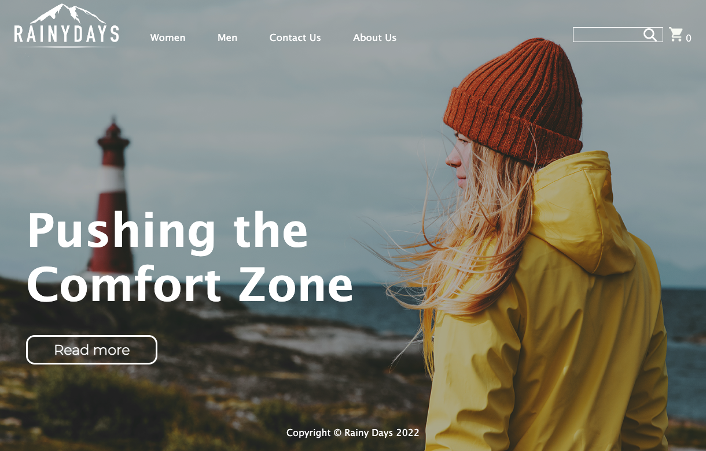

# Cross Course Project



An online shop selling men's and women’s rain jackets, that are designed for a range of different outdoor activities that enrich people's lives. 

## Description

For my cross course project, I was tasked with creating and developing a dynamic e-commerce platform for a distinctive brand selling men's and women's rain jackets, designed for enhanced outdoor experiences. 

Working through variuous stages and timelines, the project required careful planning and newly-acquired knowledge implementation in areas such as:

- Designing a prototype
- Laying the initial coding foundation with HTML/CSS
- Using Postman to test API calls and retrieve JSON data
- Using an API call to fetch product details from WordPress
- Adding functionality with JavaScript

## Built With

- [Visual Studio Code](https://code.visualstudio.com/) (HTML5, CSS, JavaScript)
- [WordPress API](https://developer.wordpress.org/rest-api/)

## Getting Started

### Installing

1. Clone the repo:

```bash
git clone https://github.com/LauraKaraliene/cross-course-project-LauraKaraliene
```

2. Navigate to the Project Directory.
   Change your current directory to the cloned repository:

```bash
cd SemesterProject1
```

3. Open the project in the code editor of your choice.
   For Visual Studio Code, you might use:

```bash
code . 
```

4. Install Dependencies.
   If using Node.js, you might instruct users to install dependencies using:

```bash
npm install
```

  For Python projects with a requirements.txt, you might use:

```bash
pip install -r requirements.txt
```

5. Start the Development Server.
   For Node.js projects, this might be:

```bash
npm start
```
   
6. Start customizing


## Contact

[Facebook](https://www.facebook.com/LAURA_KARALIENE)

[LinkedIn](www.linkedin.com/in/laura-karaliene-31476657)

[Email](mailto:laura.stanislavaviciute@gmail.com)

